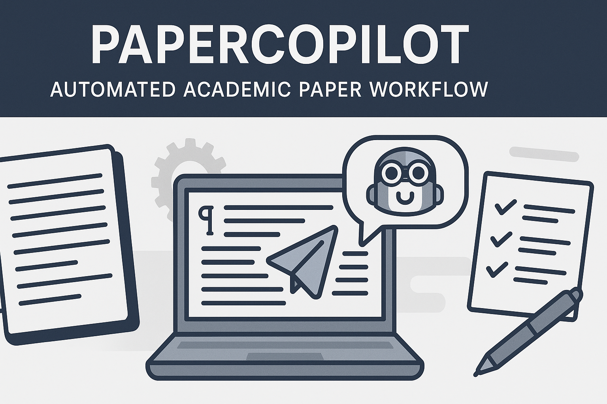

# PaperCopilot: AI-Powered Academic Writing Assistant
**Version 1.0.0 Golden**

> **Write Better Papers Faster**: PaperCopilot is your intelligent research assistant that helps you create high-quality academic papers through natural language commands in VS Code. No coding required—just tell it what you need.

## 🚀 **Quick Start**

1. **Start a new paper**: Type `initiate my_paper with [your requirements]`
2. **Generate content**: Type `create content`
3. **Get feedback**: Type `peer review my_paper`
4. **Export to Word**: Type `save to word`

**Need help?** Just type `help` or `list commands` anytime!

---

## 💡 **How It Works**

### Your AI Writing Team
- **Research Assistant**: Finds and evaluates academic sources
- **Writing Coach**: Guides you through proper academic structure
- **Citation Manager**: Handles all formatting and references
- **Peer Reviewer**: Provides publication-ready feedback
- **Export Specialist**: Creates professional Word documents

### Simple Command Interface
Everything works through natural language commands in VS Code with GitHub Copilot:
- No programming knowledge needed
- Just type what you want to do
- Get intelligent, context-aware assistance
- Professional results every time

---

## 📋 **Essential Commands**

### Getting Started
- **`help`** - Get assistance and guidance
- **`list commands`** - See all available commands
- **`initiate [folder] with [requirements]`** - Start a new paper

### Content Creation
- **`create content`** - Generate all sections using AI
- **`show outline`** - View your paper structure
- **`dive [section name]`** - Deep dive into specific sections

### Quality Control
- **`peer review [folder]`** - Comprehensive paper review
- **`fact-check [folder]`** - Verify all claims and sources
- **`professor [folder]`** - Get academic evaluation with grade
- **`review content`** - Review for academic quality and compliance
- **`checklist`** - Display or update the completion checklist

### Export & Submission
- **`save to word`** - Export to professional Word document
- **`submit [folder] to [publication]`** - Test journal compatibility
- **`show requirements`** - Show the current paper requirements

**💡 Tip**: Type `help` or `list commands` whenever you're unsure what to do next!

---

## 🎯 **What You Can Create**

### Paper Types
- **Research Papers**: IMRaD format, literature reviews, case studies
- **Essays**: Analytical, argumentative, reflective
- **Academic Reports**: Project reports, dissertations, short communications
- **Reviews**: Systematic reviews, literature surveys

### Citation Styles
- **APA 7** (Psychology, Social Sciences)
- **IEEE** (Engineering, Computer Science)
- **MLA** (Literature, Humanities)
- **Chicago** (History, Arts)
- **Harvard** (Business, STEM)
- **Vancouver** (Medical Sciences)
- And more!

---

## 🔧 **Example Workflow**

```
# Start a new research paper
initiate climate_research with requirements:
- Title: "Climate Change Impacts on Urban Planning"
- Style: APA 7
- Type: Research Paper
- Length: 5000 words

# Generate the content
create content

# Get feedback
peer review climate_research

# Check facts and sources
fact-check climate_research

# Export to Word
save to word

# Test journal fit
submit climate_research to Nature Climate Change
```

---

## 📚 **Features**

### Smart Content Generation
- AI-powered research assistance
- Structured outlines and templates
- Automatic citation management
- Professional academic tone

### Quality Assurance
- Built-in peer review process
- Comprehensive fact-checking
- Reference validation
- Publication readiness assessment

### Professional Output
- High-fidelity Word document export
- Multiple citation style support
- Proper academic formatting
- Page breaks and section organization

---

## 🆘 **Getting Help**

### When You're Stuck
- Type **`help`** for general assistance
- Type **`list commands`** to see all available options
- Type **`show outline`** to see your paper structure
- Type **`show requirements`** to review your paper specs

### Example Commands
- "Help me find sources on climate change"
- "Review my introduction section"
- "How should I structure my methodology?"
- "Check if my citations are properly formatted"

---

## 📁 **Project Structure**

Your paper folder will automatically contain:
- `paper.md` - Your main paper content
- `input_requirements.md` - Paper specifications
- `CHECKLIST.md` - Quality control tracker
- Various review files (peer reviews, evaluations, etc.)

---

## 🌟 **Key Benefits**

- **No Technical Skills Required** - Pure natural language interface
- **Professional Quality** - Academic-grade output every time
- **Time Saving** - Automated research, writing, and formatting
- **Quality Assurance** - Built-in review and validation processes
- **Multi-Style Support** - Works with all major citation styles
- **Export Ready** - Professional Word documents for submission

---

## Sample Academic Paper

A fully developed sample academic paper is provided in the `sample_paper` folder. This paper demonstrates the complete documentation-driven workflow, including:
- IMRaD structure (Introduction, Methods, Results, and Discussion)
- In-text citations and APA 7 references
- Model selection guidelines and comparison tables
- Python code examples for all major regression models
- Dataset generator supporting all code examples
- Professor-style critique and publication-ready review
- Export to Word using the clean converter

You can use this sample as a reference for structure, formatting, and workflow best practices.

---

**Ready to get started?** Type `help` or `list commands` to begin your academic writing journey!

*For technical details, see `WORKFLOW.md`, `DECISIONS.md`, and documentation in the `guidelines/` folder.*
